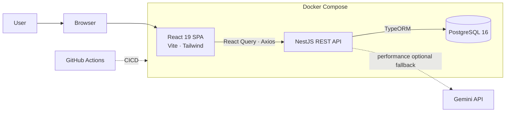
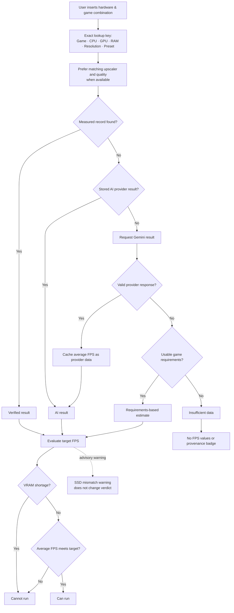

#  Can I Run It

<p align="center"> 


<br>
 
</p>
Can I Run It is a full-stack PC gaming compatibility checker. Choose a game,
CPU, GPU, RAM, storage type, resolution, graphics preset, and target FPS to get
a source-labelled compatibility result.
</br>
Public demo URL: pending.

## Architecture

Browser runs the React SPA, which queries the NestJS REST API.
Only the NestJS API queries PostgreSQL and the Gemini AI provider.
</br>
The frontend and backend are containerized with Docker Compose, using a CICD pipeline to build and test the stack on GitHub Actions.



## Compatibility behavior

User input consists of a picked game and hardware combination (CPU, GPU, RAM, optional SSD/HDD), game settings (resolution, graphic preset) and target FPS.
</br>
The Frontend sends a POST request to the API, which returns a source labelled result card with an FPS panel and optional advisory warning.
</br>
Results prefer measured data, then stored AI provider data, then a local heuristic estimate, and finally an insufficient-data verdict. Gemini results are chached in DB for future requests.
</br>



## Run with Docker

### Prerequisites

- Docker with Docker Compose
- Git

### Configuration

`infra/.env` is the single configuration file used by the development and
production Compose stacks. The isolated test stack uses deterministic values
from its Compose file instead.
</br>
Copy the tracked template, then replace its example values for your environment:

```bash
cp infra/.env.example infra/.env
```

Keep `POSTGRES_HOST=postgres` for containers. `REACT_URL` is the browser-facing
frontend origin allowed by production CORS. `VITE_API_URL` is compiled into the
production frontend and must be a browser-reachable backend URL ending in
`/api`. Set `GEMINI_API_KEY` to a valid key to enable Gemini, or leave it empty
to use the heuristic/insufficient-data fallback.

Do not commit `infra/.env`.

### Development

```bash
docker compose --env-file infra/.env -f infra/docker-compose.yml up -d --build
```

With the template's default ports, open:

- Frontend: <http://localhost:3000>
- API: <http://localhost:4000/api>
- Swagger: <http://localhost:4000/api/docs>
- PostgreSQL health: <http://localhost:4000/api/health/postgres>

Follow or stop the development stack with:

```bash
docker compose --env-file infra/.env -f infra/docker-compose.yml logs -f
docker compose --env-file infra/.env -f infra/docker-compose.yml down
```

### Production

Using the production Compose file is similar to development's compose, using the file `infra/docker-compose.prod.yml` instead of `infra/docker-compose.yml`.
</br>
</br>
Build and restart the production stack with the latest images:

```bash
docker compose --env-file infra/.env -f infra/docker-compose.prod.yml up -d --build
```

The production frontend is built with `VITE_API_URL`, starts only after the API
is healthy, and the API starts only after PostgreSQL is healthy. Production
TypeORM schema synchronization is disabled.

### Tests

The isolated test stack initializes PostgreSQL, runs backend unit tests, then
runs the real database E2E suite, including `POST /api/v1/check`:

```bash
docker compose -f infra/docker-compose.tests.yml up --build --exit-code-from backend --abort-on-container-exit
```

## Schema and seed data

The tracked files in `infra/init-scripts/` define the PostgreSQL schema and the
curated demo seed. PostgreSQL runs them in filename order when it initializes a
fresh Compose volume. They do not rerun on every container restart.

Development and production use persistent named volumes.
</br>
To apply a fresh bootstrap, first back up any data you need, then remove the relevant stack's
volume with `docker compose --env-file infra/.env -f <compose-file> down -v` and
start it again. The `-v` operation permanently deletes that stack's database
volume.

## API

The public compatibility route is `POST /api/v1/check`.
</br>
See the [backend guide](backend/README.md) for the request/response contract and API limits.
</br>
See the [frontend guide](frontend/README.md) for UI behavior and local
scripts.

## Current limits and future work

1. The tracked seed is curated, not exhaustive.
2. Gemini is the only implemented AI provider, uses an eight-second backend timeout, and can be unavailable because of configuration, provider errors, or invalid responses.
3. The fallback heuristic is deliberately coarse and requires usable game requirements.
4. The check route's 10 requests per minute limit is in process, so it is not shared across multiple backend replicas.

5. Future work includes:
   - additional AI providers
   - provider neutral orchestration
   - trained ML performance model
   - broader measured coverage

## License

This project is licensed under the [Mozilla Public License 2.0](LICENSE).
