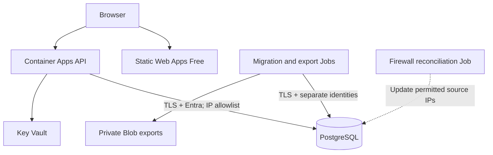

# Azure production architecture

Status: approved design; repository implementation under review, Azure acceptance pending.
Decision date: 2026-10-02. Local implementation record: [acceptance](../operations/azure-acceptance.md).
Repository baseline: staging, commit `4ef01411a987c4c9d9d8a73ced7124a5683524c9`.
This document is authoritative for the planned Azure deployment. It supersedes earlier
customer-VNet/private-database and VM proposals. Existing Compose behavior is separate.

## Purpose and budget

Host a small public portfolio demo: approximately 10–20 games and a small performance
dataset. Target the first Azure for Students credit year; 8–10 months is acceptable if
a full year is impractical. The credit is $100, with no automatic paid upgrades.

A year means about $8.33/month before reserve. Aim for $7–8/month average or less,
including all Azure resources. This is a planning target, not a verified bill or
availability guarantee. Subscription entitlement, region availability, telemetry,
job execution, requests, storage transactions and outbound transfer must be checked
before provisioning. See [implementation gates](azure-terraform-handoff.md).

## Services and fixed choices

| Component | Approved configuration |
| --- | --- |
| Frontend | Azure Static Web Apps Free; React/Vite static build; default HTTPS hostname; SPA fallback |
| Backend | Azure Container Apps; Workload Profiles environment, Consumption profile only; default Azure-managed network |
| API container | 0.5 vCPU, 1 GiB; Single revision; minReplicas 0, maxReplicas 1; external HTTPS ingress, port 4000 |
| Database | Azure Database for PostgreSQL Flexible Server; PostgreSQL 16; Burstable B1ms; 32 GiB; autogrow off |
| Database network | Public endpoint; built-in PostgreSQL firewall; exact required IPv4 addresses only |
| Database authentication | Microsoft Entra-only in Azure; dedicated user-assigned managed identities; local Compose retains passwords |
| Secrets | Dedicated Key Vault, RBAC; native Container Apps Key Vault references |
| Maintenance | Finite Container Apps Jobs for migrations, exports and firewall reconciliation |
| Images | Public GHCR packages; deploy immutable image digests |
| Terraform state | Separate Standard LRS Blob account/container; Entra/OIDC authorization and state locking |
| Portable exports | Separate Standard Hot LRS Blob account; private container; keep two completed dump sets |
| Monitoring | Dedicated Log Analytics + workspace-based Application Insights; 10% traces, 30-day retention, 0.1 GB/day caps |
| Region | West Europe candidate; confirm allowed region, SKU quota and free eligibility in this subscription |

Database backups: seven-day retention, local redundancy, no geo redundancy, no HA.
The database remains running; backend scale-to-zero does not stop PostgreSQL.
Application DB pool: maximum five connections per API process, with bounded timeouts.

There is no customer VNet, subnet, private DNS zone, private endpoint, VM, ACR,
NAT Gateway, Azure Firewall, Application Gateway, Front Door or separately provisioned
load balancer. Azure manages ingress/routing internally. Do not infer that Azure's
platform has no internal load balancing. Do not add network resources to stabilize
egress without revisiting both the architecture and the budget.

The SPA issues requests directly to the API HTTPS hostname. Only backend services
query PostgreSQL, RAWG and Gemini. CORS permits the deployed SPA origin; it does not
make the API private or authenticate callers. Provider secrets never enter frontend
build variables.

## Public database boundary

The database hostname is public and may be discovered. Access requires all three:
an authorized source IP, verified TLS, and a valid Entra principal with SQL privileges.
The browser receives no DB credentials or direct DB connection.

Reject any internet-wide firewall range and the Azure-services bypass rule
(including the special 0.0.0.0 rule). An IP allowlist is not proof of application
identity: platform addresses can be shared, so authentication and SQL grants remain
essential.

Container Apps outbound IPs can change. A fixed API URL, one replica, and a static
ingress IP do not provide static egress. Read the API's and each DB-connected Job's
`properties.outboundIpAddresses` separately. Never substitute the environment's
inbound IP or assume a Job uses the API's addresses.

Reconcile allowlists at deployment, before manual maintenance, and hourly through
a small dedicated control Job. IP changes can temporarily interrupt DB access until
reconciliation and firewall propagation finish. This availability tradeoff is accepted
for this demo. Empty/invalid discovery fails closed; it never enables broad access.
Details and resource ownership are in [the Terraform handoff](azure-terraform-handoff.md).

## Cold starts and scaling

Start at zero minimum replicas. Measure activation until the container can serve a
successful readiness request, separately from the compatibility request's processing
time. Include image pull, Node/Nest initialization, token acquisition, DB connection
and readiness/ingress routing. Record repeated real scale-from-zero trials, with
median and p95 activation overhead, total first-request latency and warm latency.

If normal activation takes more than three seconds, prefer a future hybrid schedule:
minReplicas 1 during chosen public-demo hours, 0 otherwise. Warm hours are not yet
chosen. Use Asia/Jerusalem with daylight-saving handling and calculate the added cost
before enabling that schedule. Do not promise a three-second startup. Current probe
intervals can themselves delay observed readiness; tuning must retain safe startup.

Use `/api/health/live` for startup/liveness and `/api/health/ready` for DB readiness.
Neither should contact providers. Existing initial DataSource initialization has no
retry loop; implement bounded connection retries and fail startup after its budget.
A running API's DB outage should fail readiness without inducing liveness restarts.

Single revision/maxReplica 1 limits ordinary serving capacity, but deployment and
platform transitions may overlap processes. Process-local rate/provider budgets
reset on restart and are not daily spend caps.

## Identities, secrets and data ownership

| Principal | Purpose | Authorization |
| --- | --- | --- |
| Human Entra administrator | Initial SQL bootstrap, ownership review, emergency operations | PostgreSQL Entra administrator; temporary exact operator IP |
| Backend user-assigned MI | Runtime API | Key Vault Secrets User; SQL runtime grants only |
| Migration user-assigned MI | TypeORM migrations and explicit initial seed | Owns application schema/objects; no role administration |
| Export user-assigned MI | Portable dumps | Read-only SQL; Blob Data Contributor on export container only |
| Firewall-control user-assigned MI | Keep DB source rules current | Read app/Job ARM properties; scoped firewall management and control-metadata Blob access; no SQL identity |
| Export-check user-assigned MI | Daily schedule/cost checks and export trigger | Read scheduling metadata/cost data, write control metadata, start firewall-control/export Jobs |
| GitHub platform OIDC principal | Terraform platform updates | Scoped infrastructure permissions + state data permissions |
| GitHub release OIDC principal | API/SPA release, start trusted maintenance Jobs | Scoped deployment/start permissions; no Entra DB admin or RBAC administration |

Starting or modifying a Job can execute arbitrary code under its attached identity.
Treat release and scheduler principals with corresponding trust. Avoid wildcard
secret-read permissions in custom Job operator roles.

Use a separate state storage account so export pruning/retention cannot affect state
versions, leases or soft deletion. Export data and export scheduling metadata share
the export account in separate private containers. Do not grant the runtime API
access to state, Blob exports, Cost Management or firewall management.

Passwords do not offer a meaningful infrastructure saving over built-in Entra/MI
authentication. Entra P1/P2 is not a prerequisite for this basic authentication flow.
Require Azure DB tokens to refresh for newly opened pool connections; do not cache
one token for the entire deployment lifetime.

Provider/admin secret values are created outside Terraform. Terraform accepts only
secret URI/name metadata and identity IDs; it must not read actual values using data
sources, outputs, tfvars or provisioners. State/plans still require protection because
other values, including generated monitoring settings, can be sensitive.

Key Vault references are versionless by default. Rotation may take up to roughly
30 minutes to refresh; environment-variable secret references can restart revisions.
Document verification and emergency explicit revision restart after rotation.

## Database lifecycle and portability

Migrations use TypeORM in a finite Job, before API release; never automatically on
every HTTP process startup. Keep `synchronize=false`. Convert the legacy SQL history
into one consistent migration baseline. Fresh init scripts already contain the newer
schema, so blindly replaying legacy migration 001 will fail.

Initial seed runs explicitly once as a repeatable maintenance operation. It must not
overwrite later manual edits. Future admin POST/PATCH routes are tracked separately
in [issue #82](https://github.com/YuvalAnteby/Can-I-Run-It/issues/82). Include
`ADMIN_API_ENABLED` and `ADMIN_API_KEY` in the environment template when implementing
that issue; production secret injection follows this design.

Azure automatic backups support Azure recovery. Portable custom-format `pg_dump`
exports support a later AWS/GCP move. Export approximately every four calendar months,
manually on demand, and once at each verified $80/$90 credit-period consumption
threshold. Keep the newest two successfully uploaded/validated dump sets.
See [database and export operations](../operations/azure-database.md).

## Source references

Verified 2026-10-02. Confirm current provider/API support during implementation.

- [Azure for Students offers](https://azure.microsoft.com/en-us/free/students)
- [Container Apps networking and changing outbound IPs](https://learn.microsoft.com/en-us/azure/container-apps/networking)
- [Container Apps billing and shared monthly grants](https://learn.microsoft.com/en-us/azure/container-apps/billing)
- [PostgreSQL firewall rules](https://learn.microsoft.com/en-us/azure/postgresql/security/security-firewall-rules)
- [Managed identity PostgreSQL connections](https://learn.microsoft.com/en-us/azure/postgresql/security/security-connect-with-managed-identity)
- [Container Apps native Key Vault references](https://learn.microsoft.com/en-us/azure/container-apps/manage-secrets)
